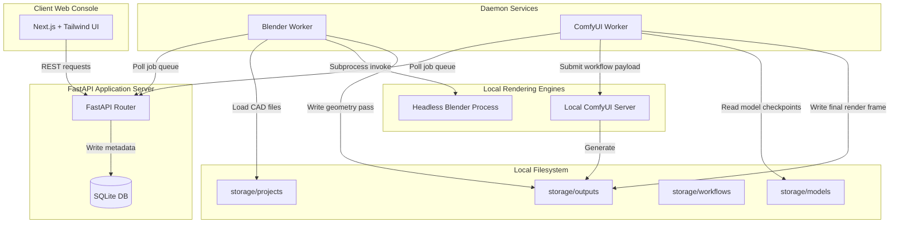

# RenderPilot System Architecture

RenderPilot is designed as a local-first, low-latency system for architectural visualization. It runs entirely on the user's local machine, meaning all assets, databases, and generative pipelines reside offline.

## Data Flow Diagram

---

## Architectural Modules

### 1. Web Console (`apps/web`)
A modern, dark-mode Next.js single-page application.
- Exposes controls to configure prompt parameters and select visualization presets.
- Monitors predicted hardware impact and updates user indicators if boundaries are exceeded.
- Displays real-time CLI console logs from active visualization processes.

### 2. Backend Router (`apps/api`)
A FastAPI web server acting as the configuration directory and orchestration manager.
- Exposes REST routes to query/register projects and jobs.
- Implements validation barriers (via Pydantic schemas) to enforce a safe VRAM footprint.
- Performs updates to the SQLite database schema at runtime startup.

### 3. Blender Extraction Daemon (`workers/blender_worker`)
A polling service written in Python that retrieves pending render assignments.
- Spawns a headless Blender background process via Python subprocesses.
- Automates the camera and geometry extraction scripts to render preliminary depth/detail templates.
- Outputs files to `storage/outputs/` for downstream stable diffusion processing.

### 4. Generation Pipeline Daemon (`workers/comfy_worker`)
A polling service written in Python that handles diffusion tasks.
- Assembles JSON workflows conforming to the ComfyUI API standard.
- Verifies local model checkpoint requirements (e.g., standard SD 1.5 checkpoints).
- Polls the local ComfyUI WebSocket/History API and writes finalized outputs.

---

## SQLite Metadata Schema

### Projects Table
Tracks local CAD project folders.
- `id` (VARCHAR, Primary Key): Unique alphanumeric ID.
- `name` (VARCHAR): Display name.
- `source_file` (VARCHAR): Path to local `.blend` source.
- `created_at` / `updated_at` (DATETIME).

### Render Jobs Table
Tracks specific rendering requests and execution histories.
- `id` (VARCHAR, Primary Key): Unique ID.
- `project_id` (VARCHAR, Foreign Key): Project association.
- `status` (VARCHAR): Workflow state (`PENDING`, `BLENDER_EXPORT`, `GENERATING`, `COMPLETED`, `FAILED`).
- `preset_name` (VARCHAR): Preset selector used.
- `prompt` / `negative_prompt` (TEXT).
- `batch_size` (INTEGER): Default 1.
- `controlnet_layers` (INTEGER): Default 1.
- `output_image_path` (VARCHAR): Final rendered filepath.
- `error_message` (VARCHAR): Error tracking.
- `created_at` / `completed_at` (DATETIME).
